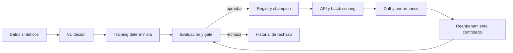

# ChurnOps MLOps Monitoring & Retraining System

ChurnOps es un sistema de referencia local-first y cloud-ready para operar un clasificador
binario de churn con gobierno explícito. Incluye datos sintéticos, validación, entrenamiento
determinista, baseline y challenger, registry local inmutable, API FastAPI, scoring batch,
drift, monitoreo con etiquetas y reentrenamiento controlado.

## Por qué es MLOps

No depende de notebooks ni de un dashboard decorativo. El valor está en el ciclo completo:
contrato de datos, pipeline sklearn persistido, métricas reproducibles, promoción con gates,
trazabilidad, inferencia, monitoreo, rollback, pruebas, Docker y CI/CD.



## Inicio rápido

```bash
uv sync --dev
uv run churnops demo
uv run uvicorn churnops.api:app --host 0.0.0.0 --port 8000
```

Secuencia manual de entrenamiento y promoción:

```bash
uv run churnops generate-data
uv run churnops train --model logistic_regression
uv run churnops promote
uv run churnops train --model random_forest
uv run churnops evaluate
uv run churnops promote
```

`logistic_regression` es el baseline y `random_forest` es el candidate/challenger. El CLI
también acepta los aliases `--model baseline` y `--model candidate`, pero el registry conserva
los nombres canónicos. Repetir `churnops promote` sobre un candidato ya rechazado devuelve
`already_rejected` sin traceback y sin modificar el registro inmutable del rechazo.

La API expone `/health`, `/model/info`, `/predict`, `/predict/batch` y `/metrics/summary`.
El umbral, versión de modelo y `request_id` forman parte del contrato de respuesta.

## Gobierno del modelo

Cada versión guarda `model.joblib`, métricas, metadata, configuración, fingerprint del dataset
y model card. El alias `champion` solo cambia si el candidato cumple ROC-AUC, F1, recall y
validación. Los candidatos rechazados conservan métricas y motivos.

## Monitoreo

- PSI y prueba KS para variables numéricas.
- Distancia de variación total para categorías.
- Cambio en la distribución de predicciones.
- Métricas completas y alertas cuando existe un batch etiquetado.

## Cloud-ready y seguridad

Las plantillas GCP no se aplican. Proponen Cloud Run, Cloud Run Jobs, Cloud Storage, Artifact
Registry, Secret Manager, Logging/Monitoring y OIDC de GitHub Actions. No existen credenciales,
PII real, datasets externos, despliegues automáticos ni recursos persistentes.

Costo esperado local: **$0 MXN**. Costo cloud V1: **$0**, porque no se despliega nada.

Consulta [docs/architecture.es.md](docs/architecture.es.md) y el resto de [docs/](docs/) para
arquitectura, monitoreo, seguridad, Docker, CI/CD, despliegue y empaquetado de portafolio.
