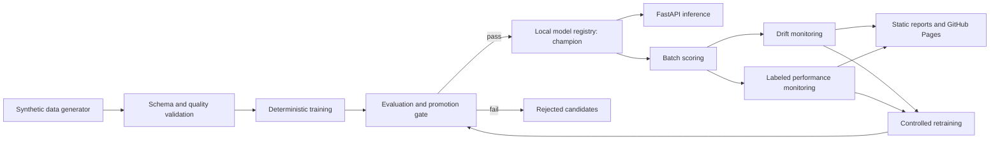

# ChurnOps MLOps Monitoring & Retraining System

[](https://github.com/BGIA1/churnops-ml-monitoring/actions/workflows/ci.yml)
[](https://github.com/BGIA1/churnops-ml-monitoring/actions/workflows/codeql.yml)
[](https://github.com/BGIA1/churnops-ml-monitoring/releases)
[](https://www.python.org/)
[](LICENSE)

**Live demo placeholder:** `https://BGIA1.github.io/churnops-ml-monitoring/`

Spanish documentation: [README.es.md](README.es.md)

## Executive Summary

ChurnOps is a local-first, cloud-ready reference system for the governed lifecycle of a
binary churn classifier. It generates synthetic data, validates every batch, trains
deterministic sklearn pipelines, evaluates baseline and challenger models, promotes only
through explicit quality gates, serves the champion with FastAPI, monitors drift and labeled
performance, and performs controlled retraining without blindly replacing production state.

The default workflow runs on a laptop and incurs no cloud cost. GCP and GitHub deployment
assets are templates only.

## Problem Statement

A model is not production-ready because it achieved a good metric once. Teams also need
repeatable data contracts, traceable artifacts, safe promotion, stable inference contracts,
monitoring, rollback information, and automation that fails closed. This repository
demonstrates those engineering concerns around a deliberately understandable churn use case.

## Why This Is MLOps, Not a Notebook

- The sklearn preprocessing and estimator are persisted as one versioned pipeline.
- Training, evaluation, registry, inference, batch scoring, monitoring, and retraining share
  tested package code rather than notebook state.
- A filesystem registry preserves immutable versions, aliases, metrics, metadata, model cards,
  dataset fingerprints, configuration snapshots, and rejection reasons.
- Champion updates require measurable gates. Failed challengers are recorded.
- CI runs static analysis, tests, coverage, the deterministic lifecycle demo, API tests, and a
  container build.

## Architecture



See [docs/architecture.md](docs/architecture.md) for component boundaries and cloud mapping.

## Model Lifecycle

1. Generate deterministic synthetic training and operational batches.
2. Validate required columns, types, ranges, categories, nulls, and identifiers.
3. Split train/validation/test data with an explicit seed.
4. Train Dummy, Logistic Regression, or Random Forest sklearn pipelines.
5. Compute ROC-AUC, F1, precision, recall, accuracy, Brier score, and confusion matrix.
6. Register an immutable candidate with provenance and model card.
7. Promote only if absolute or champion-relative gates pass.
8. Score batches, measure drift, evaluate labeled performance, and retrain under the same gate.

Promotion never overwrites model files. The `champion.json` alias moves to an immutable version,
which also makes rollback a documented alias update.

## Monitoring and Retraining

Feature monitoring includes PSI and KS tests for numeric variables and total variation distance
for categorical distributions. Prediction drift compares mean churn probabilities. Labeled
batches produce the complete classification metric set and degradation alerts.

`churnops retrain` validates the retraining dataset, registers a Random Forest challenger,
compares it with the champion, and either promotes it or records a rejection reason.

## Quickstart

```bash
uv sync --dev
uv run churnops demo
uv run uvicorn churnops.api:app --host 0.0.0.0 --port 8000
```

Useful CLI commands:

```bash
uv run churnops generate-data
uv run churnops train --model logistic_regression
uv run churnops promote
uv run churnops train --model random_forest
uv run churnops evaluate
uv run churnops promote
uv run churnops batch-score
uv run churnops monitor-drift
uv run churnops monitor-performance
uv run churnops retrain
uv run churnops report
```

`logistic_regression` is the baseline model and `random_forest` is the
candidate/challenger. The CLI also accepts the convenience aliases
`--model baseline` and `--model candidate`; registry metadata and version names always use
the canonical model names. Repeating `churnops promote` for an already rejected candidate
returns a controlled `already_rejected` response and preserves the immutable rejection record.

API example:

```bash
curl http://localhost:8000/health
curl http://localhost:8000/model/info
```

Interactive OpenAPI documentation is available at `http://localhost:8000/docs`.

## Docker

Run `uv run churnops demo` first so a champion exists, then:

```bash
docker compose up --build
```

The image excludes local data, registry artifacts, reports, caches, `.env`, and secrets. The
Compose service mounts the local model registry read-only.

## Cloud-Deployment Readiness

The non-applied templates under `infra/gcp` map the API to Cloud Run, scheduled operations to
Cloud Run Jobs, artifacts to Cloud Storage and Artifact Registry, secrets to Secret Manager,
and telemetry to Cloud Logging and Monitoring. Future GitHub deployment uses workload identity
federation (OIDC), not long-lived service-account keys.

No workflow deploys automatically. The GCP workflow is manual, placeholder-driven, and fails
unless explicit configuration is supplied.

## CI/CD and Security

GitHub Actions provides CI, CodeQL, Release Please, Pages publication, and a disabled-by-default
manual GCP template. Dependabot covers Python and Actions. Workflows use least-privilege
permissions. The project uses no real PII, external datasets, API keys, or committed `.env`.
Enable GitHub secret scanning and branch protection in repository settings after publication.

## Cost Control

- Local V1 expected cost: **$0 MXN**.
- Cloud V1 cost: **$0**, because this repository does not deploy resources.
- Future deployment should use Cloud Run scale-to-zero, budgets, quotas, retention policies,
  and explicit teardown of services, jobs, buckets, repositories, secrets, and monitoring rules.

See [docs/cost-control.md](docs/cost-control.md).

## Limitations

- Synthetic data does not represent a real population or fairness profile.
- The local registry is intentionally single-node and lacks concurrent writer coordination.
- V1 has no API authentication; production should add an identity-aware gateway or verified
  OIDC/JWT middleware.
- Monitoring thresholds are demonstration defaults and require domain calibration.
- The static Pages site is an artifact snapshot, not an operational dashboard.

## Roadmap

- Object-storage registry backend with atomic alias updates.
- Authenticated service-to-service inference and structured audit logs.
- Calibration, fairness evaluation, and data-contract version negotiation.
- Scheduled Cloud Run Jobs after infrastructure review and budget approval.
- OpenTelemetry traces and managed alert routing.

## What This Project Demonstrates

- End-to-end ML lifecycle BGIA1ship across data, modeling, serving, and operations.
- Deterministic experimentation translated into production-oriented package code.
- Explicit champion/challenger governance, traceability, rollback, and rejected-candidate history.
- Practical CI/CD, container security, cloud readiness, and cost-aware architecture.

## CV Bullets

- Built a Python 3.12 local-first MLOps platform covering deterministic sklearn training,
  filesystem model registry, champion/challenger promotion, FastAPI inference, drift detection,
  labeled performance monitoring, and controlled retraining.
- Implemented CI, CodeQL, Dependabot, release automation, Docker packaging, GitHub Pages
  reporting, and safe GCP Cloud Run/Terraform templates using future OIDC authentication.

## Interview Explanation

Start with the risk the project controls: retraining is not allowed to silently replace the
champion. Then walk through the shared data contract, immutable registry, promotion gate,
online and batch inference, drift versus performance monitoring, and the manual-only cloud
boundary. The key design choice is a complete lifecycle with intentionally modest models.

## Development

```bash
make install
make check
```

Detailed guides are under [docs/](docs/). The project is licensed under the [MIT License](LICENSE).
